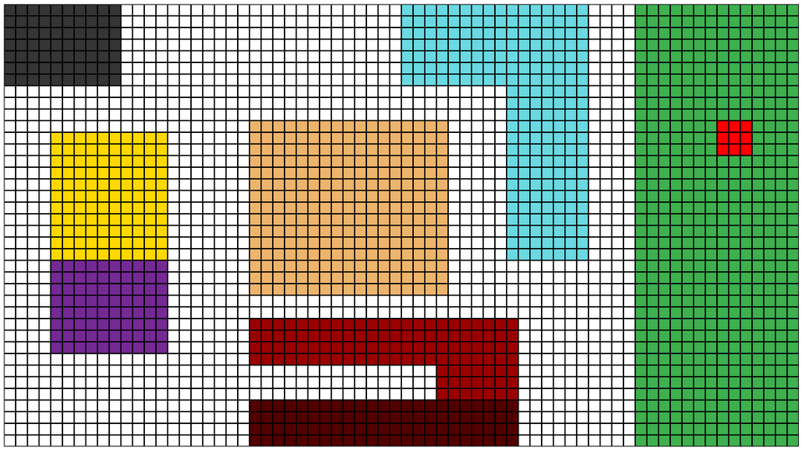
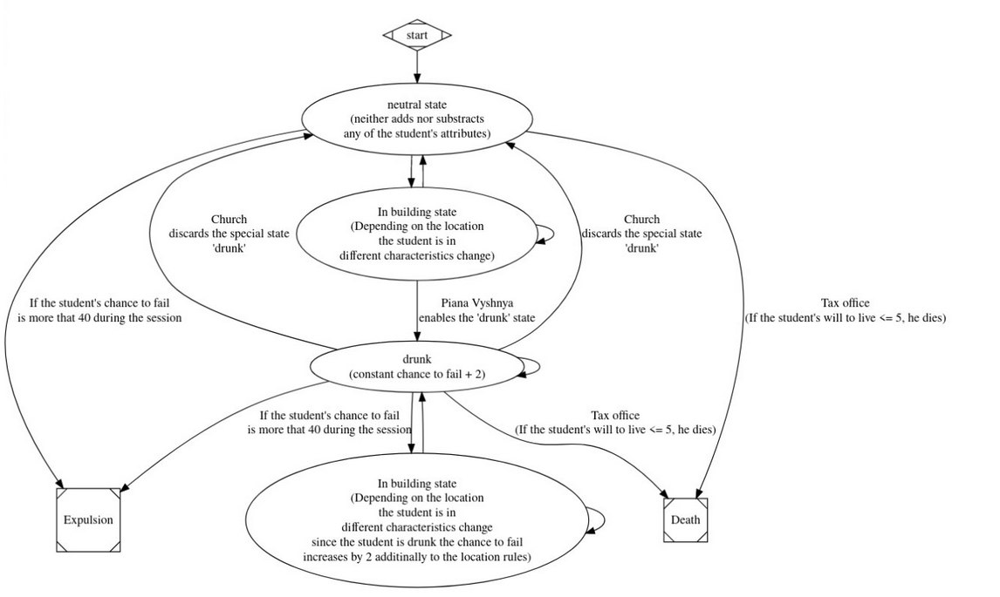

  Курс Дискретної Математики 2024

  Частина 2

  Комп’ютерний проект

  Тема: Дослідження й симуляція 

  штучного життя за

  допомогою теорії автоматів

 

та машини Тюрінга

  Вступна частина

&emsp;Наша команда обрала найцікавішу із запропонованих тем і вирішила створити симуляцію життя студентів ФПН. Ми створили спрощену мапу кампусу УКУ, на якій зобразили головні місця перебування студентів.

  Іл. 1. Поле, на якому проходять всі події симуляції

	
- Чорний колір - податкова
- Жовтий колір - трапезна
- Фіолетовий колір - IT-простір
- Оранжевий колір - церква
- Червоний колір - К1
- Темно червоний колір - К2 0 поверх
- Блакитний колір - ЦШ
- Зелений колір - Стрийський парк
- Світло червоний колір - П’яна вишня

&emsp;За основу ідеї ми взяли Conway's Game of Life та його цікаве зображення об’єктів на деякому полі. Об’єкти уваги - студенти, які за допомогою деяких характеристик визначають для себе місце, куди вони будуть йти

  Правила симуляції

&emsp;Кожен студент має деякі характеристики, за допомогою яких визначається його колір (плідною роботою нашої команди, було визначено, що ці характеристики - необхідний мінімум для реалізації вартісного продукту, дані якого хоча б приблизно будуть пов'язані з реальністю):
 - chance to fail
 - will to live

&emsp;Студенти переміщуються за допомогою алгоритму, який з деяким шансом визначає, що студент піде в будь-якому напрямку або піде у місце, яке буде йому найвигідніше з огляду на його характеристики. Для того, щоб юніти не обирали один найвигідніший шлях, було задано деякий шанс на віхлилення від ідеального маршруту. Навіть попри це, об'єкти дослідженя в загальному обирають вигідний шлях для підтримки високих характеристик.
Також кожен студент має власний колір, який відображає його стан. Він може бути зеленим, синім та червоним, відповідно до шансу не скласти іспит. Також відтінок кольору показує ментальне здоров’я студента. Чим темніший колір, тим воно гірше.

<!-- 

  <>

 -->

   

  Іл. 2. Студент з хорошим ментальним станом і поганим

  Скінченний автомат

&emsp;Оскільки темою проєкту були скінченні автомати та машина Тюрінга, то ми знайшли найкраще застосування для таких інструментів. Кожного студента ми зобразили через FSM, який можна побачити нижче:

  Іл. 3. Діаграма станів скінченного автомата

&emsp;Впродовж усього виконання  симуляції, студенти переходять від одного стану до іншого. Кожен стан виконує свою незалежну роль:
 - Смерть - термінальний стан, в який можна дійти за виконанням деяких умов
 - Виключення - термінальний стан, який досягається за допомогою спеціальної події ‘сесія’ за виконання деякої умови.
 - neutral state - стан, в якому студент перебуває і в якому його характеристики не змінюються
 - drunk state - запам’ятовує постійне збільшення шансу не скласти іспит + 2. Студент все одно може переходити в інші будівлі, які будуть впливати на його характеристики. Такі студенти відзначаються на мапі фіолетовим кольором
   - in building state - стан, в якому на студента накладаються спеціальні умови кожної незалежної зони мапи.
   - Стрийський парк - зона, де студенту додається бажання жити + 1
   - К2 0 поверх - зона, де студенту додається шанс не скласти іспит + 2 та бажання жити + 2
   - К1 - зона, де студенту додається бажання жити + 1, та віднімається шанс не скласти іспит - 1
   - Іт-простір - зона, віднімається бажання жити - 2 та шанс не скласти іспит - 2
   - Трапезна - зона, де додається бажання жити + 1
   - Центр Шептицького - зона, віднімається бажання жити - 1 та шанс не скласти іспит - 1
   - «П'яна вишня» - зона, що додає бажання жити + 5 та накладає спеціальний стан ʼп’янийʼ
   - Храм Святої Софії - зона, що додає бажання жити + 2 та знімає стан ‘п’яний’
   - Податкова - зона, що не додає характеристик, проте веде до іншого стану - смерть. Якщо у студента бажання жити менше за 5, по приходячи на податкову він помирає

  Івенти

????????????????????????????????????????

Також можна запустити спеціальну подію ‘сесія’, яка видалить всіх студентів, у яких шанс провалу більний за 80% від максимального. 

  Інтерфейс

&emsp;Для того, щоб додати студентів студентів, потрібно лівою кнопкою мишки натиснути на екран запущеної симуляції, і з’явиться студент. Його характеристики визначаються випадково, проте є деякий поріг, щоб студент не з'явився з дуже низькими характеристиками. 

  Інформація про код

&emsp;Код запускається з файлу main.py, в якому відбувається запуск алгоритму. Для візуалізації ми використали pygame, через невелику складність володіння ним. Весь допоміжний код розбитий на модулі для кращого розуміння структури програми:
 - main:
   - На клік від користувача ми користуємось базовим функціоналом pygame, за допомогою якого задаємо координати студенту та за допомогою бібліотеки random вибираємо йому характеристики в певному діапазоні.
   - В циклі student_behavour ми перевіряємо стан кожного студента та оновляємо їх дані.

 - student_class.py:
   - Модуль, де знаходяться класи кожної із зон із своїми правилами

   - Клас студента, де знаходиться його логіка поведінки

 - fsm.py:
   - У цьому модулі знаходиться логіка переходу між різними будівлями в building state. Тут знаходяться переходи між станами, та задання змін у характеристиках для студентів

 - домоміжні модулі:
   - tile.py:
   Задання класу Tile, який використовує функціонал pygame та створює картинки клітинок для візуалізації

   - settings.py:
   Модуль, де знаходяться мапа для візуалізації та налаштування візуальної частини проєкту.

   - board.py:
   Задання узагальнюючого класу Board, що складається з змінних класу Tile та об'єднює мапу із settings.py

  УКУ 2024

